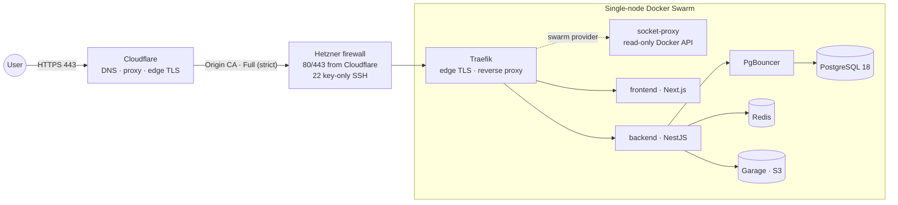

<div align="center">

# 📸 Dropicture

**Free, open source photo platform built for data ownership.**
Run it on your own machine, on a server you control, or on European cloud infrastructure. Your photos never have to leave hardware you trust.

[](https://github.com/redjem-amir/dropicture/actions/workflows/deploy.yml)
[](LICENSE)

[Website](https://dropicture.com) · [Architecture](#architecture) · [Run it locally](#run-it-on-your-machine) · [Deploy it](#deploy-it) · [Issues](https://github.com/redjem-amir/dropicture/issues)

</div>

---

## Why Dropicture

Most photo services keep your library on someone else's cloud, usually a big US provider. Dropicture is the opposite of that. It's a full photo service, MIT-licensed, that you host yourself.

There are three ways to run it:

- **On your own machine.** One Compose file brings up the whole stack locally, and your photos stay on your disk.
- **On your own cloud.** Any Linux box running Docker Swarm can host the production stack, and it fits on a small VPS.
- **On European infrastructure.** The reference setup targets [Hetzner](https://www.hetzner.com/) (Falkenstein, Germany) and is described entirely as code in this repo: one `terraform apply` and one Ansible playbook.

Whichever mode you pick, media is stored in a self-hosted, S3-compatible [Garage](https://garagehq.deuxfleurs.fr/) bucket and metadata goes in PostgreSQL. No third-party object storage, no vendor lock-in.

## Architecture



| Service | Role | Image |
|---|---|---|
| `proxy` | Edge TLS termination and Swarm-aware reverse proxy | `traefik:v3.7.4` |
| `socket-proxy` | Read-only Docker API for Traefik's Swarm provider | `tecnativa/docker-socket-proxy:v0.4.2` |
| `dropicture-frontend` | Web client | `ghcr.io/redjem-amir/dropicture/frontend` |
| `dropicture-backend` | REST API, NestJS and TypeORM, rate limiting | `ghcr.io/redjem-amir/dropicture/backend` |
| `dropicture-pgbouncer` | Transaction-level connection pooling | `edoburu/pgbouncer:v1.24.1-p1` |
| `dropicture-db` | Relational store for metadata | `postgres:18.4` |
| `dropicture-redis` | In-memory cache and throttle storage | `redis:8.8.0-alpine` |
| `dropicture-garage` | S3-compatible object storage for media | `dxflrs/garage:v2.3.0` |

## Repository layout

```
dropicture/
├── .github/workflows/         # CI/CD: build, publish to GHCR, deploy over SSH
├── apps/
│   ├── backend/               # REST API (NestJS, TypeORM)
│   └── frontend/              # Web client (Next.js)
├── docs/diagrams/             # Architecture, deploy and Ansible diagrams (PlantUML)
├── infra/
│   ├── ansible/               # Server provisioning and Swarm bootstrap
│   └── terraform/             # Hetzner and Cloudflare infrastructure (IaC)
├── docker-compose.local.yml   # Local full stack (data layer plus apps)
├── docker-compose.yml         # Production stack (Docker Swarm)
├── garage.toml                # Garage (S3) object-storage config
├── HELP.md
└── LICENSE                    # MIT
```

## Run it on your machine

**Prerequisites:** Docker with Compose v2. You only need Node.js (20 or newer) if you want to run the apps outside Docker in watch mode.

Create a `.env` at the repo root. It's gitignored. The heredoc delimiter is left unquoted on purpose so the `openssl` calls actually run and produce real secrets:

```bash
cat > .env <<EOF
# Database
POSTGRES_DB=dropicture
POSTGRES_USER=dropicture
POSTGRES_PASSWORD=change-me

# Object storage (Garage S3)
GARAGE_RPC_SECRET=$(openssl rand -hex 32)
S3_ACCESS_KEY_ID=GK$(openssl rand -hex 16)
S3_SECRET_ACCESS_KEY=$(openssl rand -hex 32)
S3_BUCKET=dropicture-media

# Application
DEFAULT_ADMIN_EMAIL=admin@example.com
DEFAULT_ADMIN_PASSWORD=change-me-too
NEXT_PUBLIC_URL=http://localhost:3000
EOF
```

Bring up the whole local stack (data layer plus backend and frontend):

```bash
docker compose -f docker-compose.local.yml up -d
```

Once the containers are healthy, you can reach everything here:

| Component | Address |
|---|---|
| Frontend | `http://localhost:3000` |
| Backend API | `http://localhost:3001` |
| PgBouncer (pooled Postgres) | `localhost:5432` |
| PostgreSQL (direct, for psql/IDEs) | `localhost:5433` |
| Redis | `localhost:6379` |
| Garage S3 API | `localhost:3900` |

The data layer behaves like production: the backend talks to PostgreSQL through PgBouncer in transaction-pooling mode, same as the deployed stack. The one difference is that there's no Traefik in front locally, so each service publishes its port straight on `localhost`. To work on the apps themselves, see [`apps/`](apps/) and run the backend and frontend in dev mode against the running data layer.

## Deploy it

### On your own cloud

The production stack ([`docker-compose.yml`](docker-compose.yml)) runs on any Docker Swarm host. It runs one replica of each service and is sized to fit a small VPS, around 4 GB of RAM and 2 vCPU, with room to breathe on 8 GB:

```bash
docker swarm init
docker stack deploy -c docker-compose.yml dropicture
```

Before you deploy, the stack needs a few things in place:

- The required environment variables in the shell that runs the deploy: `APP_DOMAIN` (your public hostname, which the Traefik routes match), the database and Garage/S3 credentials, `DEFAULT_ADMIN_EMAIL`, `DEFAULT_ADMIN_PASSWORD`, and `NEXT_PUBLIC_URL`.
- Three external Swarm resources holding your TLS material and proxy config:
  - config `dropicture_origin_cert`: the origin certificate (PEM)
  - config `dropicture_traefik_dynamic_v1`: Traefik's dynamic TLS config
  - secret `dropicture_origin_key`: the matching private key

`garage.toml` ships from the repo as a file-based config, so you don't have to create that one externally.

The reference Ansible playbook creates all three external resources for you. Only do it by hand if you're deploying without it.

### Reference deployment on European cloud

This is the fully automated path. It provisions a hardened single-node Swarm on Hetzner Cloud (EU), with Cloudflare DNS and edge TLS in front:

```bash
cd infra/terraform && terraform init && terraform apply   # server, firewall, DNS, Origin CA cert
cd ../ansible && ansible-playbook playbook.yml            # Docker, Swarm, configs and secrets
git push origin main                                      # CI builds the images and deploys
```

Step-by-step guides: [`infra/terraform/README.md`](infra/terraform/README.md) · [`infra/ansible/README.md`](infra/ansible/README.md).

The pipeline ([`.github/workflows/deploy.yml`](.github/workflows/deploy.yml)) builds the backend and frontend images, pushes them to GHCR tagged with the commit SHA (plus `latest` on the default branch), then deploys over SSH with `docker stack deploy` and smoke-tests the public URL. A working production deploy needs these secrets and variables available to the deploy job:

| Secret / variable | Purpose |
|---|---|
| `AWS_ACCESS_KEY_ID` / `AWS_SECRET_ACCESS_KEY` | Read the Terraform state from S3 to find the server IP |
| `SSH_PRIVATE_KEY_B64` | Base64-encoded SSH deploy key |
| `POSTGRES_DB` / `POSTGRES_USER` / `POSTGRES_PASSWORD` | Database credentials |
| `GARAGE_RPC_SECRET` | Garage RPC secret |
| `S3_ACCESS_KEY_ID` / `S3_SECRET_ACCESS_KEY` | Garage access key for the media bucket |
| `APP_DOMAIN` | Public hostname the Traefik routers match (frontend and API) |
| `DEFAULT_ADMIN_EMAIL` / `DEFAULT_ADMIN_PASSWORD` | First admin account created by the backend |
| `NEXT_PUBLIC_URL` | Public site URL used by the frontend |

> Right now the workflow only exports the first five groups in its `env:` block. `APP_DOMAIN`, `DEFAULT_ADMIN_EMAIL`, `DEFAULT_ADMIN_PASSWORD` and `NEXT_PUBLIC_URL` are required by `docker-compose.yml`, so add them to the deploy job's environment too. Otherwise `docker stack deploy` stops on the first missing variable.

Provisioning with Terraform and Ansible also needs `TF_VAR_hcloud_token` and `TF_VAR_ssh_public_key_b64`, plus the AWS credentials for the state backend.

## Security

A few things worth knowing about how this is locked down:

- The Hetzner firewall only accepts ports 80 and 443 from Cloudflare's published IP ranges, which Terraform fetches at apply time. Port 80 redirects straight to 443.
- Port 22 is open to the internet, but Ansible turns off password and keyboard-interactive auth, limits root to key-based login, and caps `MaxAuthTries` at 3.
- Cloudflare terminates TLS at the edge. The origin serves a Cloudflare Origin CA certificate with SSL mode Full (strict), a minimum of TLS 1.2, and Always Use HTTPS.
- Traefik never mounts the Docker socket itself. It reads Swarm state through a read-only socket-proxy that only exposes the endpoints it needs.
- PostgreSQL, PgBouncer, Redis and Garage live on an internal overlay network with no published ports, so nothing in the data layer is reachable from outside the Swarm.
- Credentials and the TLS private key are stored as Swarm secrets; the certificate and Traefik's dynamic config as Swarm configs.

Found a vulnerability? Please use [GitHub Security Advisories](https://github.com/redjem-amir/dropicture/security/advisories/new) instead of opening a public issue.

## Contributing

Contributions are welcome. Fork, branch, open a pull request. For anything substantial (architecture, infrastructure), open an issue first so we can talk through the approach. Infra changes should come with updated docs and diagrams.

## License

[MIT License](LICENSE). Free to use, self-host, modify and redistribute.

## Acknowledgments

Built on a stack of open source projects: [Traefik](https://traefik.io/), [Garage](https://garagehq.deuxfleurs.fr/), [Redis](https://redis.io/), [PgBouncer](https://www.pgbouncer.org/), [NestJS](https://nestjs.com/), [Next.js](https://nextjs.org/), [PostgreSQL](https://www.postgresql.org/) and [Docker Swarm](https://docs.docker.com/engine/swarm/).