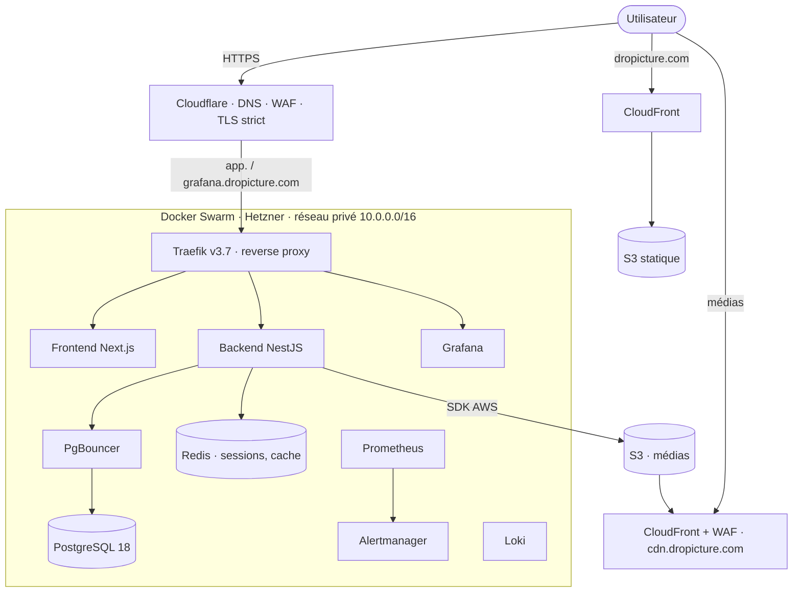

# dropicture

Plateforme SaaS de partage de photos et de vidéos, bibliothèque privée par défaut, organisation en albums, publication sélective et réversible, profils publics et fil social léger. Le projet sert de support à la certification **RNCP40573, Expert en informatique et systèmes d'information**, spécialité **DevOps (bloc BC4C, « Concevoir et déployer des infrastructures DevOps automatisées »)**.

> 📖 **Documentation technique complète dans [`docs/wiki/`](docs/wiki/)** (voir la [navigation](#documentation-technique-wiki) plus bas).
> 🎓 Dossier de certification (annexes, livrables, mémoire) dans [`docs/`](docs/).

## Sommaire

- [Aperçu](#aperçu)
- [Architecture](#architecture)
- [Structure du dépôt](#structure-du-dépôt)
- [Pile technique](#pile-technique)
- [Développement local](#développement-local)
- [Livraison continue (CI/CD)](#livraison-continue-cicd)
- [Observabilité](#observabilité)
- [Sécurité et conformité](#sécurité-et-conformité)
- [Éco-conception (green IT)](#éco-conception-green-it)
- [Documentation technique (wiki)](#documentation-technique-wiki)
- [Dossier de certification](#dossier-de-certification)

## Aperçu

dropicture est un monorepo « manuel » (sans workspaces) qui réunit trois applications.

| Application | Rôle | Techno | Hébergement |
|---|---|---|---|
| `apps/saas/backend` | API REST | NestJS 11, runtime Bun 1.3.14 | Docker Swarm (Hetzner) |
| `apps/saas/frontend` | application authentifiée | Next.js 16, React 19 | Docker Swarm (Hetzner) |
| `apps/website` | vitrine et profils publics | Next.js 16, export statique | S3 + CloudFront |

L'infrastructure est entièrement décrite en code, provisionnée par **Terraform** (Hetzner Cloud, Cloudflare, AWS), configurée par **Ansible** (Docker Swarm, durcissement, PKI, observabilité), livrée par **GitHub Actions**.

## Architecture



Vue par niveau et flux détaillés dans [`docs/wiki/02-architecture.md`](docs/wiki/02-architecture.md).

## Structure du dépôt

```
dropicture/
├── apps/
│   ├── saas/
│   │   ├── backend/     API NestJS (TypeORM, Postgres, Redis, S3)
│   │   └── frontend/    application Next.js authentifiée
│   └── website/         vitrine + profils publics (export statique)
├── infra/
│   ├── saas/
│   │   ├── terraform/   Hetzner + Cloudflare + AWS (CDN, sauvegardes, WAF)
│   │   └── ansible/     Swarm, durcissement, PKI, observabilité
│   └── website/
│       └── terraform/   S3 + CloudFront + WAF + budget
├── .github/workflows/   7 workflows (deploy, cdn, backup, recovery, destroy)
├── docs/
│   ├── wiki/            documentation technique
│   ├── livrables/       livrables de certification
│   ├── drafts/          schémas sources (.drawio)
│   └── previews/        schémas exportés (.png)
└── Taskfile.yml         commandes de développement local
```

## Pile technique

- **Backend** · NestJS 11, TypeORM, PostgreSQL 18, PgBouncer, Redis 8, Argon2id, Passport, Helmet, Throttler, contrat OpenAPI (Swagger).
- **Frontends** · Next.js 16.2.10, React 19.2.7, Tailwind v4, TypeScript.
- **Infrastructure** · Docker Swarm, Traefik v3.7, Terraform, Ansible, GitHub Actions, Hetzner Cloud, Cloudflare, AWS (S3, CloudFront, ACM, WAFv2, SSM, Budgets).
- **Observabilité** · Prometheus, Alertmanager, Loki, Grafana, Alloy, node-exporter, cAdvisor.

## Développement local

Prérequis · [Task](https://taskfile.dev), Docker, Node.js 24. Les tâches installent avec `npm`.

```bash
task saas       # backend NestJS + frontend Next.js (setup complet)
task backend    # backend seul (Postgres/PgBouncer/Redis via docker compose, migrations, dev)
task frontend   # frontend authentifié seul
task website    # site vitrine seul
```

- API `http://localhost:3002`, documentation Swagger `http://localhost:3002/api/docs`, sonde `http://localhost:3002/health`
- Frontend `http://localhost:3001`, site `http://localhost:3000`

Guide complet dans [`docs/wiki/01-demarrage-rapide.md`](docs/wiki/01-demarrage-rapide.md).

## Livraison continue (CI/CD)

| Workflow | Déclencheur | Rôle |
|---|---|---|
| `saas-deploy.yml` | manuel | tests, Trivy, build images (GHCR), Terraform, Ansible (provision, deploy, migrations) |
| `saas-cdn.yml` | manuel | périmètre CDN et sauvegardes uniquement, avec garde-fous |
| `saas-backup.yml` | cron toutes les 6 h | dump PostgreSQL vers S3 |
| `saas-recovery.yml` | manuel (confirmation) | restauration depuis S3 |
| `website-deploy.yml` | push sur `main` (chemins website) | build export, Terraform, sync S3, invalidation CloudFront |
| `ai-rightsizing.yml` | pull request infra + manuel | analyse de right-sizing et éco-conception assistée par IA |
| `*-destroy.yml` | manuel (garde-fous) | destruction contrôlée |

Le SaaS se livre manuellement, la version d'une image venant du SHA du dernier commit touchant son service. Détail dans [`docs/wiki/09-cicd.md`](docs/wiki/09-cicd.md).

## Observabilité

Pile Prometheus, Loki, Grafana, Alertmanager et Alloy déployée sur le nœud proxy, avec trois tableaux de bord (vue d'ensemble, journaux, énergie) et des règles d'alerte. Voir [`docs/wiki/10-observabilite.md`](docs/wiki/10-observabilite.md).

## Sécurité et conformité

Durcissement SSH, WAF Cloudflare et AWS, TLS strict, socket-proxy, secrets Swarm, Argon2id, sessions opaques Redis avec rotation et détection de rejeu, RGPD. Le pipeline SaaS embarque une **analyse Trivy bloquante** (dépendances, secrets, IaC, images) et produit un **SBOM CycloneDX** par image. Voir [`docs/wiki/11-securite-conformite.md`](docs/wiki/11-securite-conformite.md).

## Éco-conception (green IT)

Right-sizing des ressources, cycle de vie S3 (archive puis Glacier), cache immuable, région européenne, et **estimation supervisée de la consommation énergétique** (tableau de bord et alerte). Voir [`docs/wiki/06-strategie-devops.md`](docs/wiki/06-strategie-devops.md) et [`docs/wiki/10-observabilite.md`](docs/wiki/10-observabilite.md).

## Documentation technique (wiki)

Toute la documentation technique vit dans [`docs/wiki/`](docs/wiki/). Point d'entrée unique, ce README.

### Par où commencer, selon votre profil

| Profil | Parcours recommandé |
|---|---|
| **Nouveau contributeur** | [Démarrage rapide](docs/wiki/01-demarrage-rapide.md) · [Architecture](docs/wiki/02-architecture.md) · [Glossaire](docs/wiki/15-glossaire.md) |
| **Développeur back / front** | [API backend](docs/wiki/03-backend-api.md) · [Frontends](docs/wiki/04-frontends.md) · [Base de données](docs/wiki/05-base-de-donnees.md) |
| **Ops / SRE** | [Infrastructure](docs/wiki/07-infrastructure.md) · [Conteneurisation Swarm](docs/wiki/08-conteneurisation-swarm.md) · [CI/CD](docs/wiki/09-cicd.md) · [Observabilité](docs/wiki/10-observabilite.md) · [Sauvegarde et PRA](docs/wiki/12-sauvegarde-pra.md) · [Runbooks](docs/wiki/13-exploitation-runbooks.md) |
| **Sécurité / conformité** | [Sécurité et conformité](docs/wiki/11-securite-conformite.md) · [Sauvegarde et PRA](docs/wiki/12-sauvegarde-pra.md) |
| **Jury / évaluateur RNCP** | [Conformité RNCP40573](docs/wiki/16-conformite-rncp.md) (matrice C1 à C31), [Stratégie DevOps](docs/wiki/06-strategie-devops.md), puis la correspondance BC4C ci-dessous |

### Toutes les pages

1. [Démarrage rapide](docs/wiki/01-demarrage-rapide.md) · prérequis, commandes, environnement local
2. [Architecture](docs/wiki/02-architecture.md) · vue d'ensemble, quatre niveaux, flux de requêtes
3. [API backend](docs/wiki/03-backend-api.md) · NestJS, points d'accès, sécurité, stockage
4. [Frontends](docs/wiki/04-frontends.md) · application authentifiée et site vitrine
5. [Base de données](docs/wiki/05-base-de-donnees.md) · modèle, PostgreSQL, PgBouncer, migrations
6. [Stratégie DevOps](docs/wiki/06-strategie-devops.md) · GitOps, IaC, éco-conception
7. [Infrastructure](docs/wiki/07-infrastructure.md) · Terraform et Ansible (Hetzner, Cloudflare, AWS)
8. [Conteneurisation Swarm](docs/wiki/08-conteneurisation-swarm.md) · stack, services, réseaux, Traefik
9. [CI/CD](docs/wiki/09-cicd.md) · les sept workflows GitHub Actions
10. [Observabilité](docs/wiki/10-observabilite.md) · métriques, journaux, alerting, énergie
11. [Sécurité et conformité](docs/wiki/11-securite-conformite.md) · DevSecOps, durcissement, ISO 27001, RGPD
12. [Sauvegarde et PRA](docs/wiki/12-sauvegarde-pra.md) · sauvegardes, restauration, reprise d'activité
13. [Runbooks d'exploitation](docs/wiki/13-exploitation-runbooks.md) · déployer, revenir en arrière, incident
14. [Amélioration continue](docs/wiki/14-amelioration-continue.md) · écarts connus, dette, feuille de route
15. [Glossaire](docs/wiki/15-glossaire.md) · termes et acronymes
16. [Conformité RNCP40573](docs/wiki/16-conformite-rncp.md) · matrice C1 à C31, écarts corrigés

### Correspondance avec les critères BC4C

| Attendu du référentiel (BC4C) | Où c'est traité |
|---|---|
| Analyse de l'infrastructure existante | [Architecture](docs/wiki/02-architecture.md), [Infrastructure](docs/wiki/07-infrastructure.md) |
| Stratégie DevOps détaillée | [Stratégie DevOps](docs/wiki/06-strategie-devops.md) |
| Mise en place des pipelines CI/CD | [CI/CD](docs/wiki/09-cicd.md) |
| Implémentation de la containerisation | [Conteneurisation Swarm](docs/wiki/08-conteneurisation-swarm.md) |
| Configuration du monitoring (dashboards et alerting) | [Observabilité](docs/wiki/10-observabilite.md) |
| Alerte sur consommation énergétique (green IT) | [Observabilité](docs/wiki/10-observabilite.md), [Stratégie DevOps](docs/wiki/06-strategie-devops.md) |
| Code d'infrastructure versionné (IaC) | [Infrastructure](docs/wiki/07-infrastructure.md) |
| Plan d'amélioration continue | [Amélioration continue](docs/wiki/14-amelioration-continue.md) |
| Documentation technique complète, adaptée aux utilisateurs | l'ensemble de `docs/wiki/` |

## Dossier de certification

Le dossier lié à la certification RNCP40573 est dans [`docs/`](docs/) · livrables dans [`docs/livrables/`](docs/livrables/), schémas d'annexes dans `docs/previews/` (sources éditables dans `docs/drafts/`), mémoire et référentiel à la racine de `docs/`. Les écarts connus et la feuille de route sont dans [`docs/wiki/14-amelioration-continue.md`](docs/wiki/14-amelioration-continue.md).
