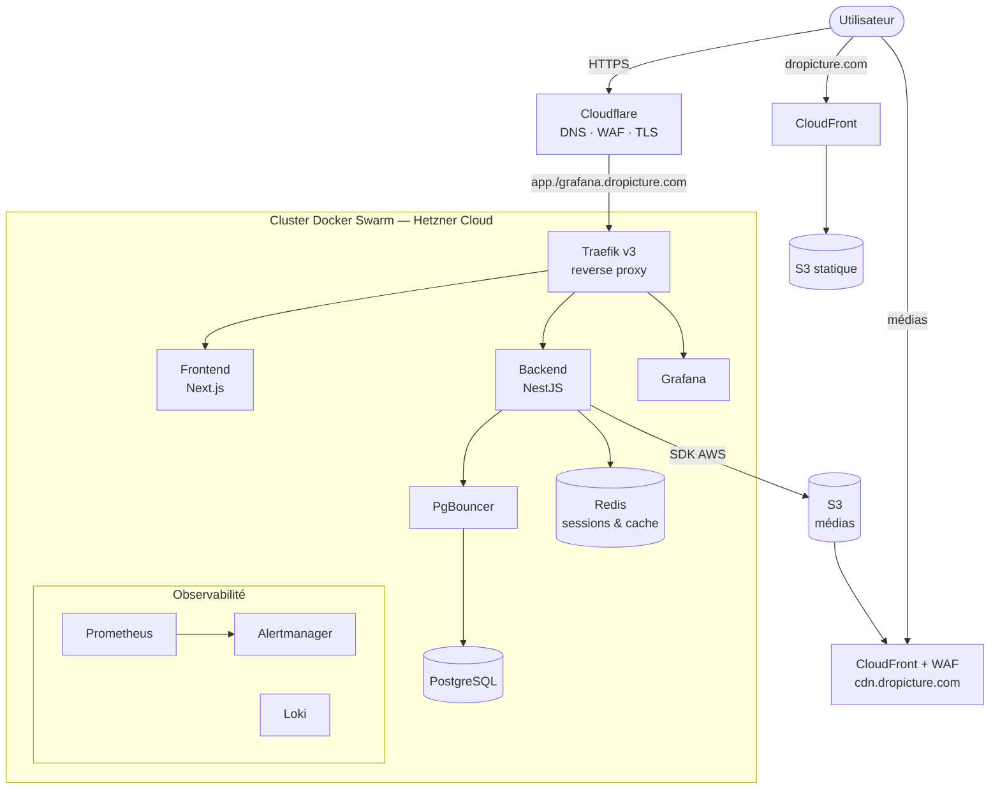

# dropicture

Plateforme SaaS de partage de photos et de vidéos : bibliothèque privée, organisation en albums, publication sélective, profils publics et fil social léger. Le projet sert de support à la certification **RNCP40573 — Expert en informatique et systèmes d'information**, spécialité **DevOps (bloc BC4C : « Concevoir et déployer des infrastructures DevOps automatisées »)**.

> 📚 Le dossier technique complet (cartographie SI, ADR, UML, MCD/MLD, stratégie DevOps, CI/CD, monitoring, sécurité, pilotage) est dans **[`docs/`](docs/README.md)**.

---

## Sommaire

- [Aperçu](#aperçu)
- [Architecture](#architecture)
- [Structure du dépôt](#structure-du-dépôt)
- [Stack technique](#stack-technique)
- [Développement local](#développement-local)
- [Déploiement (CI/CD)](#déploiement-cicd)
- [Observabilité](#observabilité)
- [Sécurité & conformité](#sécurité--conformité)
- [Éco-conception (green IT)](#éco-conception-green-it)
- [Documentation](#documentation)

## Aperçu

dropicture est un **monorepo** qui regroupe :

| Application | Rôle | Techno | Hébergement |
|---|---|---|---|
| `apps/saas/backend` | API REST | NestJS 11 (Bun) | Docker Swarm (Hetzner) |
| `apps/saas/frontend` | Application authentifiée | Next.js 16 | Docker Swarm (Hetzner) |
| `apps/website` | Site vitrine + profils publics | Next.js 16 (export statique) | S3 + CloudFront |

L'infrastructure est **entièrement décrite en code** : provisioning **Terraform** (Hetzner Cloud, Cloudflare, AWS), configuration **Ansible** (Docker Swarm, durcissement, PKI, observabilité), et **pipelines GitHub Actions** pour la livraison continue.

## Architecture



Détail par niveau (métier / fonctionnel / applicatif / infrastructure) : **[docs/architecture/cartographie-si.md](docs/architecture/cartographie-si.md)**.

## Structure du dépôt

```
dropicture/
├── apps/
│   ├── saas/
│   │   ├── backend/     # API NestJS (TypeORM, Postgres, Redis, S3)
│   │   └── frontend/    # App Next.js authentifiée
│   └── website/         # Vitrine + profils publics (export statique)
├── infra/
│   ├── saas/
│   │   ├── terraform/   # Hetzner + Cloudflare + AWS (CDN, backups, WAF)
│   │   └── ansible/     # Swarm, durcissement, PKI, monitoring
│   └── website/
│       └── terraform/   # S3 + CloudFront + WAF + budget
├── .github/workflows/   # CI/CD (deploy, cdn, destroy)
├── docs/                # Dossier technique (ce que le RNCP demande)
└── Taskfile.yml         # Tâches de développement local
```

## Stack technique

- **Backend** : NestJS 11, TypeORM, PostgreSQL 18, PgBouncer, Redis 8, Argon2, Passport, Helmet, Throttler, **Swagger/OpenAPI**.
- **Frontend / site** : Next.js 16, React 19, TypeScript.
- **Infra** : Docker Swarm, Traefik v3, Terraform, Ansible, GitHub Actions, Hetzner Cloud, Cloudflare, AWS (S3, CloudFront, ACM, WAF, SSM, Budgets).
- **Observabilité** : Prometheus, Alertmanager, Loki, Grafana, Alloy, node-exporter, cAdvisor.

## Développement local

Prérequis : [Task](https://taskfile.dev), Docker, Node.js 24 et/ou Bun.

```bash
task saas       # backend NestJS + frontend Next.js (+ Postgres/Redis via docker compose)
task backend    # backend seul
task frontend   # frontend seul
task website    # site vitrine seul
```

- API : http://localhost:3002 — **Swagger : http://localhost:3002/api/docs**
- Frontend : http://localhost:3001 · Site : http://localhost:3000

## Déploiement (CI/CD)

| Workflow | Déclencheur | Rôle |
|---|---|---|
| `saas-deploy.yml` | manuel | Tests → Terraform → build images (GHCR) → Ansible (provision + deploy + migrations) |
| `website-deploy.yml` | push `apps/website/**` | Build export → Terraform → sync S3 → invalidation CloudFront |
| `saas-cdn.yml` | manuel | Applique uniquement le périmètre CDN/backups (ciblé, garde-fous) |
| `*-destroy.yml` | manuel | Destruction contrôlée |

Détail : **[docs/devops/cicd.md](docs/devops/cicd.md)**.

## Observabilité

Stack Prometheus / Loki / Grafana déployée sur le nœud proxy, avec **dashboards** (vue d'ensemble, logs, énergie) et **alerting** (Alertmanager). Voir **[docs/devops/monitoring-observabilite.md](docs/devops/monitoring-observabilite.md)**.

## Sécurité & conformité

Durcissement SSH, WAF Cloudflare + AWS, TLS strict, socket-proxy, secrets Swarm, Argon2, sessions opaques Redis avec rotation et détection de rejeu, RGPD. Cartographie ISO/IEC 27001 : **[docs/securite-conformite.md](docs/securite-conformite.md)**.

Le pipeline de déploiement embarque une **analyse de sécurité bloquante avec Trivy** (dépendances, secrets, IaC, images Docker) et produit un **SBOM CycloneDX** par image : **[docs/devsecops-trivy.md](docs/devsecops-trivy.md)**.

## Éco-conception (green IT)

Right-sizing (reservations/limits), cycle de vie S3 (Glacier), cache immuable, compression, région EU, et **monitoring de la consommation énergétique estimée** (dashboard + alerte). Voir **[docs/devops/strategie-devops.md](docs/devops/strategie-devops.md#éco-conception--green-it)**.

## Documentation

Tout le dossier technique est dans **[`docs/`](docs/README.md)**.
