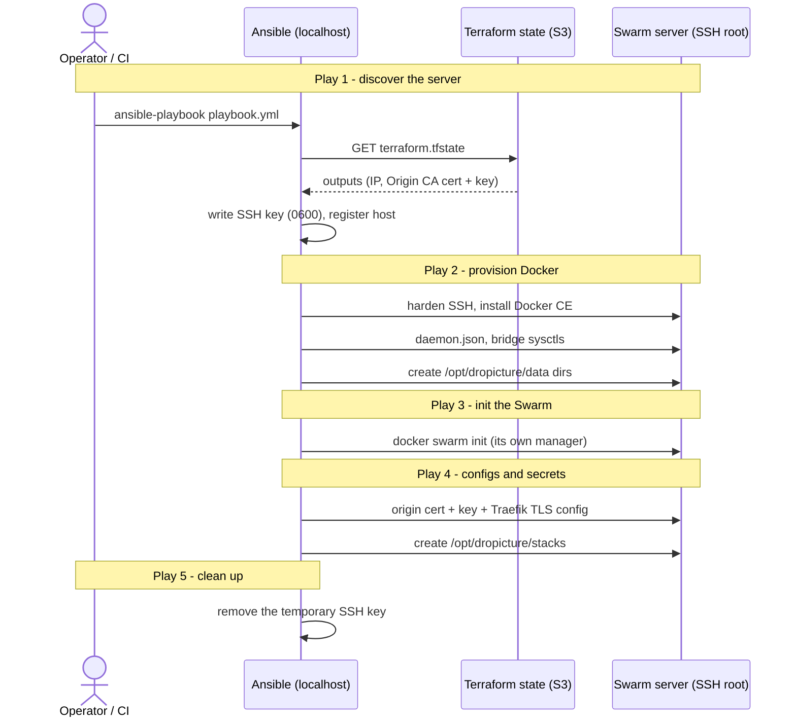

# Ansible provisioning (single-node Docker Swarm)

How `infra/ansible/playbook.yml` turns a fresh Hetzner server into a hardened, single-node Docker Swarm ready for the dropicture stack. Run it from the repo root after `terraform apply`, with the AWS credentials and the SSH key exported in the environment.

## At a glance

## What each play does

### Play 1 - Discover the server (localhost)

Reads the Terraform state and works out where to connect.

- Checks that `AWS_ACCESS_KEY_ID`, `AWS_SECRET_ACCESS_KEY` and `SSH_PRIVATE_KEY_B64` are set.
- Downloads `terraform.tfstate` from the `dropicture-tfstate-prod` bucket (eu-west-3), reads `manager_public_ip` plus the Origin CA cert and key, then deletes the local copy since it holds secrets.
- Writes the SSH private key to a temp file (mode `0600`) and registers the server in the `swarm` group.

### Play 2 - Provision Docker (over SSH)

Turns the bare Ubuntu host into a Docker host.

- Hardens SSH: key-only auth, no passwords, root login by key only, `MaxAuthTries 3`.
- Installs Docker CE (engine, CLI, buildx, compose plugin) and the Python SDK the Ansible Docker modules need.
- Writes `/etc/docker/daemon.json` for log rotation (validated before the reload).
- Loads the `bridge` and `br_netfilter` modules and sets the bridge sysctls.
- Safety guard: refuses to continue if `/opt/dropicture/data` is still a symlink to the old Hetzner volume.
- Creates the data directories on the local disk: `postgres`, `redis`, `garage/meta`, `garage/data`.

> Migrating from the old setup? rsync the volume content to the local disk, remove the symlink, then re-run the playbook.

### Play 3 - Initialise the Swarm (over SSH)

- Runs `docker swarm init` with the public IP as the advertise and listen address. The server is its own manager, with no join tokens.
- Ports 2377 / 7946 / 4789 listen publicly but stay unreachable: the Hetzner firewall only opens 22, 80, 443 and ICMP.

### Play 4 - Configure the Swarm (over SSH)

Loads the TLS material the Traefik proxy expects.

- Stores the Origin CA certificate as the Swarm config `dropicture_origin_cert`.
- Stores the private key as the Swarm secret `dropicture_origin_key`.
- Stores Traefik's dynamic TLS configuration as the Swarm config `dropicture_traefik_dynamic_v1`.
- Creates `/opt/dropicture/stacks` for the stack files.

### Play 5 - Clean up (localhost)

- Removes the temporary SSH key file.

---

*Author: Amir Redjem · 2026-06-05 · v1.3*