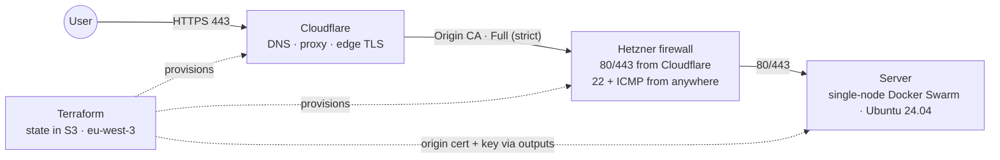

# Infrastructure (Terraform)

What `infra/terraform/` provisions: a Cloudflare-fronted, single Hetzner Cloud server that runs the dropicture stack as a one-node Docker Swarm. Terraform creates the server, firewall, DNS and TLS material; the Swarm and Docker themselves are set up afterwards by Ansible.

## At a glance

## What Terraform provisions

### Cloudflare (DNS, proxy, TLS)

- Looks up the zone by name (`data cloudflare_zone`) to get its ID.
- `A` records for the apex and `www`, both proxied, TTL 1, pointing at the server's IPv4.
- A `www -> apex` 301 redirect, plus zone settings: SSL **Full (strict)**, Always Use HTTPS, minimum TLS 1.2.
- An Origin CA certificate (`origin-rsa`, ~15 years / 5475 days) covering `dropicture.com` and `*.dropicture.com`.

### Hetzner Cloud (server, firewall, key)

- One server, `${project}-manager-1`, type set by `var.server_type` (the variable allows cpx22, cpx32 or cpx42), Ubuntu 24.04, public IPv4 and IPv6, no private network. It becomes the single Docker Swarm manager (the Swarm is initialised by Ansible, not Terraform).
- A firewall that allows 80 and 443 only from Cloudflare's published ranges, and 22 + ICMP from anywhere. SSH stays key-only, enforced by Ansible.
- An SSH key for the `root` account, read from a base64 variable.

### TLS material (origin certificate)

- A private key (`tls_private_key`, RSA 2048, `prevent_destroy`) and a CSR feed the Cloudflare Origin CA certificate.
- The certificate and key are exposed as sensitive outputs (`origin_cert_pem`, `origin_key_pem`), which Ansible then stores as a Swarm config and a Swarm secret.

### Terraform setup and state

- Requires Terraform >= 1.10, with the hcloud (~> 1.45), cloudflare (~> 5), tls (~> 4.0) and http (~> 3.4) providers.
- State lives in an S3 backend: bucket `dropicture-tfstate-prod`, encrypted, with a lock file, in eu-west-3.
- A `http` data source fetches Cloudflare's current IPv4 and IPv6 ranges to fill the firewall rules.

## Request path

A request reaches Cloudflare over HTTPS. Cloudflare proxies it to the origin with **Full (strict)** TLS, validated against the Origin CA certificate, and the Hetzner firewall only lets 80 and 443 through from Cloudflare. Port 80 redirects to 443.

---

*Author: Amir Redjem · 2026-06-05 · v1.3*