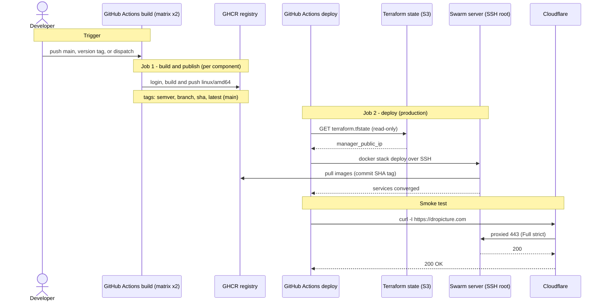

# CI/CD pipeline (build, publish and deploy)

What `.github/workflows/deploy.yml` does: build the backend and frontend images, publish them to GHCR, then deploy the stack over SSH to the single-node Swarm and smoke-test the public URL.

## At a glance

## Trigger

The workflow runs on a push to `main`, a `v*.*.*` tag, or a manual dispatch, but only when something that affects the image or the stack changes: `apps/**`, `docker-compose.yml`, `garage.toml`, or the workflow file. Concurrency is keyed per workflow and ref, runs are not cancelled in progress, and the build matrix does not fail fast.

## Job 1 - Build and publish

Runs once per component (backend and frontend) through a matrix.

- Checks out the repo and sets up Buildx.
- Logs in to GHCR with the `GITHUB_TOKEN` (packages: write).
- Computes tags with `metadata-action`: semver, branch, long commit SHA, and `latest` on the default branch.
- Builds and pushes a `linux/amd64` image, caching layers in GitHub Actions (`type=gha`, scoped per component).

> amd64 only: the Hetzner CPX target is AMD EPYC (x86_64), so there is no QEMU step and no arm64 build.

## Job 2 - Deploy

Runs after the build, only on `main` or a `v*` tag, in the `production` environment (concurrency group `deploy-production`).

- Passes `IMAGE_TAG=sha-<commit>` plus the stack's required variables: `APP_DOMAIN`, `NEXT_PUBLIC_API_URL`, `DEFAULT_ADMIN_*`, `POSTGRES_*`, `GARAGE_RPC_SECRET`, `S3_*`.
- Reads `terraform.tfstate` from S3 (AWS creds, read-only) and pulls `manager_public_ip` with `jq`, asserting it is non-empty.
- Loads the SSH key into an ssh-agent (in memory only, never written to disk) and runs `ssh-keyscan`.
- Runs `docker stack deploy --prune --detach=false` against the server over SSH (`DOCKER_HOST=ssh://root@...`). The server pulls the SHA-tagged images.

> 1 replica per service, rolling updates stop-first (a brief downtime per service), rollback on failure for the app services, and `--detach=false` waits for the stack to converge.

## Smoke test

A final `curl -fsSI https://dropicture.com` with 5 retries, 10s apart. Cloudflare proxies the request to the origin on 443 (Origin CA, Full strict); a `200` means the deploy is healthy and the workflow reports success.

---

*Author: Amir Redjem · 2026-06-05 · v1.1*