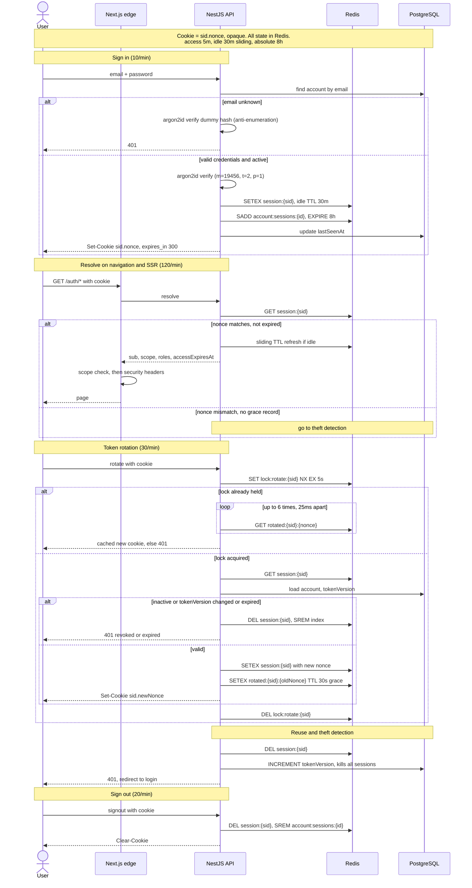

# Session and token security

How dropicture handles sessions: opaque sliding sessions stored in Redis, short-lived access with rotation, and detection of a replayed (stolen) cookie. Source: `apps/backend/src/{controllers/auth.controller.ts, services/auth.service.ts, services/redis.service.ts, guards/access.strategy.ts}` and `apps/frontend/src/{proxy.ts, lib/session.ts, components/UserProvider.tsx}`.

## The model

The session cookie is opaque: `sid.nonce`, not a JWT. All the real state lives in Redis and the cookie is only a lookup key. Three windows apply: access 5 minutes, idle 30 minutes (sliding), and an absolute cap of 8 hours. Every `/api/*` call is rate-limited per endpoint, and in production it must carry Cloudflare's `cf-connecting-ip` header (a missing header is a 403).

## At a glance

## Sign in (`POST /api/auth/signin`, 10/min)

The API looks up the account by email. If the email is unknown it still runs an argon2id verify against a dummy hash, so the response takes constant time and does not leak whether the email exists, then returns 401. If the account exists it verifies the password with argon2id (`m=19456, t=2, p=1`). A wrong password, or a status that is not active, returns 401 (or 403 for pending, suspended or banned).

On success it creates a session: a 32-byte `sid` and a 16-byte `nonce`, both base64url. It writes `session:{sid}` to Redis with a 30-minute idle TTL, storing scope, roles, tokenVersion, an `ipHash` (sha256 truncated to 16 bytes), an absolute expiry of +8h and an access expiry of +5m. It adds the sid to `account:sessions:{id}` with an 8h expiry, updates `lastSeenAt` in Postgres, and sets `session=sid.nonce` (HttpOnly, Secure in prod, SameSite=Lax) with `{ expires_in: 300 }`.

## Resolve on navigation and SSR (`POST /api/auth/resolve`, 120/min)

The browser's `UserProvider` schedules a refresh about 60 seconds before `accessExpiresAt` and coordinates tabs through a `BroadcastChannel`; the edge middleware also rotates on navigation when it is already inside that 60-second margin.

On a request the API reads `session:{sid}`. If the nonce matches and the session is not past its absolute expiry, it slides the idle TTL (rewriting `lastUsedAt` and the TTL once more than ~30s have passed) and returns `{ sub, scope, roles, accessExpiresAt }`. The edge then checks the route scope (a missing scope gives /403, an unknown route /404) and adds the security headers (HSTS, X-Frame-Options DENY, nosniff, Referrer-Policy, Permissions-Policy) before serving the page. If the nonce does not match and there is no grace record, it falls through to theft detection.

## Token rotation (`POST /api/auth/session`, 30/min)

To rotate, the API takes a short lock: `SET lock:rotate:{sid} NX EX 5s`. If the lock is already held (a concurrent refresh from another tab), it polls `rotated:{sid}:{nonce}` up to 6 times, 25ms apart, and returns the cached new cookie if it appears, otherwise 401.

If it gets the lock, it reads `session:{sid}` and loads the account (status, tokenVersion). If the account is inactive, the tokenVersion has changed, or the session is past its absolute expiry, it deletes the session and returns 401. Otherwise it mints a new nonce, refreshes scope and roles, sets a fresh +5m access expiry, and rewrites `session:{sid}` with the new nonce. It also writes `rotated:{sid}:{oldNonce}=newCookie` with a 30-second TTL, so in-flight requests still carrying the old nonce succeed during that grace window. It returns the new cookie and releases the lock.

## Reuse and theft detection

An old nonce with no grace record means the cookie was captured and replayed. The API burns everything: it deletes `session:{sid}` to terminate the session, and increments `accounts.tokenVersion` in Postgres, which invalidates every other session for that account at its next rotation. The client gets a 401 and is redirected to login.

## Sign out (`POST /api/auth/signout`, 20/min)

Deletes `session:{sid}`, removes the sid from `account:sessions:{id}`, and clears the cookie.

## Role and scope changes

Changing a role or scope calls `applyScopesToActiveSessions`, which rewrites every session listed in `account:sessions:{id}` in place, so new permissions take effect without forcing the user to log in again.

---

*Author: Amir Redjem · 2026-06-05 · v1.0*