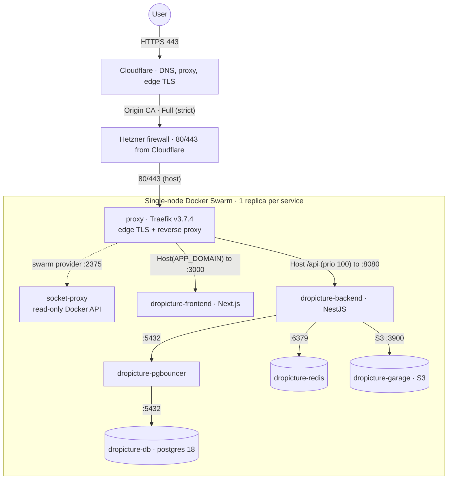

# Application stack (Docker Swarm)

What `docker-compose.yml` deploys: the dropicture runtime as a single-node Docker Swarm, one replica per service, fronted by Traefik. A request comes in through Cloudflare and the Hetzner firewall, hits Traefik, and is routed to the frontend or the backend; the backend talks to Postgres (through PgBouncer), Redis and Garage on an internal network.

## At a glance

## Services

| Service | Image | Role | Limits |
|---|---|---|---|
| `proxy` | `traefik:v3.7.4` | Edge TLS and reverse proxy, ports 80/443 (host); routers on `Host(APP_DOMAIN)`, file + swarm providers | 0.50 vCPU / 128M |
| `socket-proxy` | `tecnativa/docker-socket-proxy:v0.4.2` | Read-only Docker API (:2375) for Traefik's swarm provider; mounts the docker socket read-only | 0.10 vCPU / 32M |
| `dropicture-frontend` | `ghcr.io/redjem-amir/dropicture/frontend` | Next.js web client, serves :3000 | 1.00 vCPU / 512M |
| `dropicture-backend` | `ghcr.io/redjem-amir/dropicture/backend` | NestJS REST API, :8080 (`/health`) | 1.50 vCPU / 768M |
| `dropicture-pgbouncer` | `edoburu/pgbouncer:v1.24.1-p1` | Transaction pooling (:5432), pool 10, max 200 clients, scram-sha-256 | 0.25 vCPU / 64M |
| `dropicture-db` | `postgres:18.4` | Postgres, `max_connections=50`, `shared_buffers=256MB` | 1.50 vCPU / 1G |
| `dropicture-redis` | `redis:8.8.0-alpine` | Cache and throttle store, `maxmemory 256mb`, `allkeys-lru`, `save 1800 1` | 0.50 vCPU / 384M |
| `dropicture-garage` | `dxflrs/garage:v2.3.0` | S3 object storage (:3900), single-node, default bucket | 1.00 vCPU / 768M |

## Networks

Three overlay networks keep the data plane off the internet:

- `frontend` (external-facing): `proxy`, `dropicture-frontend`, `dropicture-backend`.
- `backend` (internal, no published ports): `dropicture-backend`, `dropicture-pgbouncer`, `dropicture-db`, `dropicture-redis`, `dropicture-garage`.
- `socket` (internal): `proxy` and `socket-proxy` only, so Traefik never touches the Docker socket directly.

## Persistence

`dropicture-db`, `dropicture-redis` and `dropicture-garage` use bind mounts on the host SSD under `/opt/dropicture/data` (the per-service directories are created by Ansible).

## Configs and secrets

Traefik's TLS material and Garage's config are mounted as Swarm configs and secrets:

- config `dropicture_traefik_dynamic_v1` (external) into Traefik at `/etc/traefik/dynamic/tls.yml`.
- config `dropicture_origin_cert` (external) into Traefik at `/etc/traefik/certs/origin.crt`.
- secret `dropicture_origin_key` (external) into Traefik at `/run/secrets/origin.key`.
- config `dropicture_garage_config_v2` (from `./garage.toml`) into Garage at `/etc/garage.toml`.

The first three external resources are created by Ansible; `garage.toml` ships from the repo.

## Deploy

One replica per service, rolling updates stop-first (a brief downtime per service), restart on failure. The stack requires `APP_DOMAIN`, `NEXT_PUBLIC_URL`, `DEFAULT_ADMIN_*`, `POSTGRES_*`, `S3_*` and `GARAGE_RPC_SECRET` in the deploy environment.

---

*Author: Amir Redjem · 2026-06-05 · v1.0*