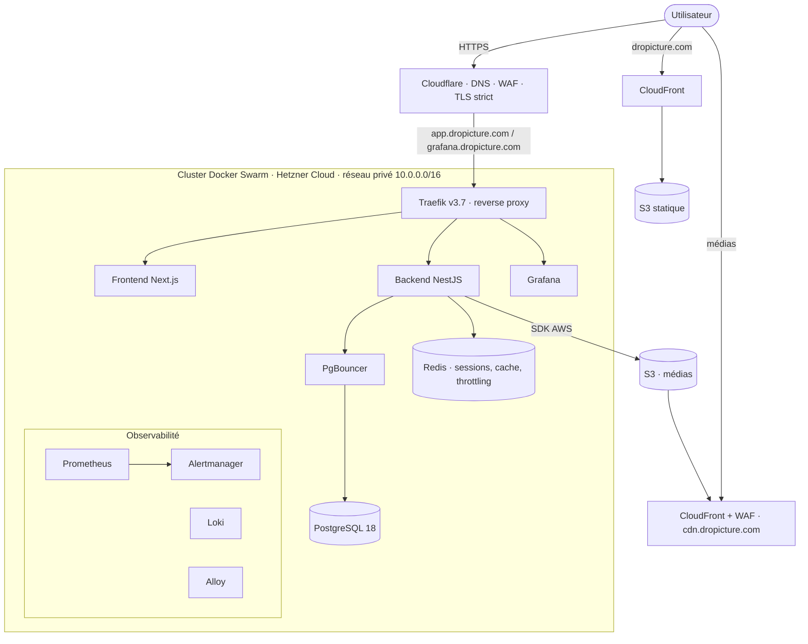

# 02 · Architecture

## Vue d'ensemble

dropicture est un monorepo « manuel » (sans workspaces npm) qui réunit trois applications et deux domaines d'infrastructure.

| Composant | Rôle | Techno | Hébergement |
|---|---|---|---|
| `apps/saas/backend` | API REST | NestJS 11, runtime Bun | Docker Swarm (Hetzner) |
| `apps/saas/frontend` | application authentifiée | Next.js 16, React 19 | Docker Swarm (Hetzner) |
| `apps/website` | vitrine et profils publics | Next.js 16, export statique | S3 + CloudFront |
| `infra/saas` | cluster applicatif et CDN médias | Terraform + Ansible | Hetzner, Cloudflare, AWS |
| `infra/website` | site statique | Terraform | AWS, Cloudflare |

Deux principes structurent tout le reste.

- **Privé par défaut.** Un média déposé est privé. Seule une action explicite le publie, et cette action est réversible.
- **Réversibilité et souveraineté.** L'infrastructure est reconstructible par le code, hébergée en Europe, et l'utilisateur dispose d'une clé d'API pour accéder à sa propre bibliothèque.

## Schéma d'ensemble



Description textuelle. Le trafic entre par Cloudflare (DNS, pare-feu applicatif, TLS strict). Les sous-domaines applicatifs `app` et `grafana` sont routés vers Traefik sur le nœud proxy du cluster Swarm. Traefik distribue vers le frontend, le backend et Grafana. Le backend parle à PostgreSQL au travers de PgBouncer, et à Redis pour les sessions, le cache et la limitation de débit. Les médias sont déposés sur S3 par le backend et servis par CloudFront sur `cdn.dropicture.com`. Le site vitrine est un export statique servi par une seconde distribution CloudFront sur `dropicture.com`.

## Les quatre niveaux de la cartographie du SI

Le référentiel demande une cartographie aux quatre niveaux fondamentaux. Les planches détaillées sont dans les annexes (Annexe A.1 à A.4).

- **Métier.** Un membre gère une bibliothèque privée, la range en albums, publie certains médias, se constitue un profil public et suit d'autres membres.
- **Fonctionnel.** Authentification et sessions, bibliothèque et albums, publication et retrait, profil public, découverte et fil social, réglages et clé d'API.
- **Applicatif.** Un backend NestJS, un frontend Next.js authentifié, un site vitrine statique, PostgreSQL, Redis, un stockage objet S3 derrière CloudFront.
- **Infrastructure.** Quatre nœuds Hetzner en Docker Swarm, Cloudflare en périphérie, AWS pour le CDN médias et les sauvegardes, tout décrit en Terraform et configuré par Ansible.

## Flux de requêtes principaux

Trois séquences détaillées existent en annexe (Annexe I.1 à I.3). Résumé.

- **Téléversement d'un média.** `POST /api/library/uploads`. Le corps de la requête est traité en flux vers S3 (jamais bufferisé entièrement en mémoire), le compteur d'octets coupe le flux au-delà de la limite, le média est créé privé.
- **Publication et partage.** `PATCH /api/library/publish`. Bascule d'état par lot, idempotente et réversible par `unpublish`.
- **Session sécurisée.** Cookie opaque adossé à Redis, glissant 30 minutes, absolu 8 heures, avec rotation et détection de rejeu.

## Découpage du dépôt

```
dropicture/
├── apps/
│   ├── saas/
│   │   ├── backend/     API NestJS (TypeORM, Postgres, Redis, S3)
│   │   └── frontend/    application Next.js authentifiée
│   └── website/         vitrine + profils publics (export statique)
├── infra/
│   ├── saas/
│   │   ├── terraform/   Hetzner + Cloudflare + AWS (CDN, sauvegardes, WAF)
│   │   └── ansible/     Swarm, durcissement, PKI, observabilité
│   └── website/
│       └── terraform/   S3 + CloudFront + WAF + budget
├── .github/workflows/   CI/CD (deploy, cdn, backup, recovery, destroy)
├── docs/                dossier de certification (annexes, livrables, mémoire)
├── wiki/                cette documentation technique
└── Taskfile.yml         commandes de développement local
```

Pages liées · [Infrastructure](07-infrastructure.md) · [Conteneurisation Swarm](08-conteneurisation-swarm.md) · [API backend](03-backend-api.md).
