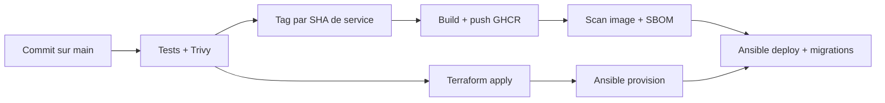

# 06 · Stratégie DevOps

Cette page résume les choix DevOps du projet et leur justification. Elle répond à l'attendu « stratégie DevOps détaillée » du bloc BC4C.

## Principes

- **Tout est reconstructible par le code.** Aucun serveur n'est configuré à la main. Terraform décrit ce qui est provisionné, Ansible décrit comment c'est configuré, GitHub Actions orchestre les deux. Perdre l'ensemble des machines n'entraîne pas la perte du service, seulement un temps de reconstruction.
- **Séparation provisionnement et configuration.** Terraform crée les nœuds, le réseau, le CDN. Ansible installe Docker, initialise le Swarm, pose la PKI et déploie la stack. La frontière est nette et testable.
- **Deux modèles de livraison adaptés au risque.** Le site vitrine, statique et sans état, se livre automatiquement à chaque push. Le SaaS, avec état et données, se livre manuellement, sur déclenchement explicite.
- **Sécurité au plus tôt.** L'analyse Trivy est bloquante dans le pipeline SaaS, avant tout déploiement.
- **Éco-conception mesurée.** La consommation énergétique estimée est un signal supervisé, pas une intention.

## GitOps et traçabilité des versions

Le dépôt Git est la source de vérité. Pour le SaaS, la version d'une image ne vient pas d'un tag manuel mais du **SHA du dernier commit touchant le dossier du service**. Deux conséquences.

- Une image porte l'empreinte exacte du code qui l'a produite.
- Relivrer sans changement de code ne reconstruit rien (le build est idempotent, il saute si l'image existe déjà dans le registre).

## Infrastructure as Code

- **Terraform** pour Hetzner, Cloudflare et AWS, état distant sur S3 chiffré et verrouillé.
- **Ansible** pour la configuration du cluster, avec un inventaire entièrement dynamique reconstruit depuis l'état Terraform.
- **Le formatage Terraform est vérifié au commit** (hook `pre-commit`).

Détails en [Infrastructure](07-infrastructure.md).

## Cycle de livraison

Le détail des sept workflows est en [CI/CD](09-cicd.md).

## Éco-conception (green IT)

L'éco-responsabilité n'est pilotable que si elle est mesurée. Plusieurs leviers.

- **Right-sizing.** Chaque service Swarm déclare des réservations et des limites CPU et mémoire ajustées à son besoin réel plutôt qu'à une marge de confort.
- **Cycle de vie des objets S3.** Les sauvegardes quotidiennes passent en classe archive à 30 jours, les mensuelles en Glacier, avec expiration programmée.
- **Cache immuable et compression.** Les médias sont servis avec un cache long immuable par CloudFront, ce qui évite de recalculer et retransmettre.
- **Région européenne.** Calcul chez Hetzner (Falkenstein), CDN médias sur AWS `eu-west-3`.
- **Mesure de la consommation.** Des règles Prometheus estiment la puissance en watts, l'énergie en kWh par jour et le carbone par heure et par nœud, avec une alerte au-delà d'un seuil de puissance. Voir [Observabilité](10-observabilite.md).

## Place de l'IA

Le référentiel encourage l'usage d'outils d'IA. Dans l'état actuel, aucun outil d'IA n'est branché dans les workflows. Les pistes (assistance au code, prédiction d'incident, optimisation de pipeline) sont recensées dans [Amélioration continue](14-amelioration-continue.md).

Pages liées · [Infrastructure](07-infrastructure.md) · [CI/CD](09-cicd.md) · [Observabilité](10-observabilite.md).
